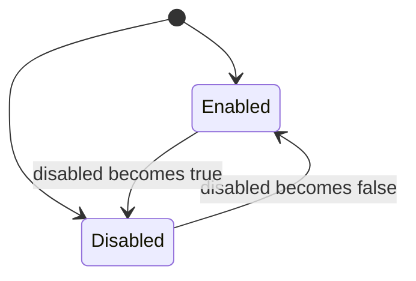
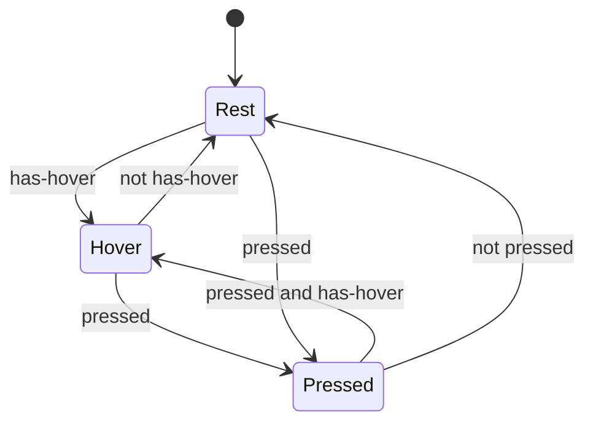
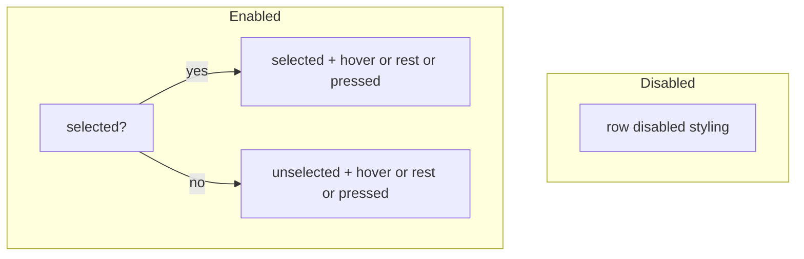

# Primer Slint interaction states

## Repo context

- **Contributor guide:** [`packages/primer-slint/AGENTS.md`](../../../packages/primer-slint/AGENTS.md) — `primer.slint` / `tokens.slint` pointers, **Verification** commands.
- **Reference implementation:** [`packages/primer-slint/Checkbox/checkbox.slint`](../../../packages/primer-slint/Checkbox/checkbox.slint) — uses `states [ … ]` on a named sub-element (`check-visuals`) with conditions like `filled-pressed when !root.disabled && root.filled && touch.pressed`.

## Workflow (do this before coding)

1. **List state dimensions** — e.g. `disabled`, pointer `hover` / `pressed`, `selected`, `checked`, `focus` (if modeled), theme (`ColorScheme`).
2. **Mark mutex groups** — dimensions that cannot apply at the same time in a way that needs separate styling (e.g. `disabled` vs enabled interaction chain; `rest` vs `hover` vs `pressed` only when enabled).
3. **Draw a small statechart** (Mermaid below) so mutually exclusive branches are obvious.
4. **Assign defaults** on the painted element for the “base” case (e.g. rest, enabled, unchecked).
5. **Add Slint `states [ … ]`** with named states and **property overrides only** — avoid repeating full ternary trees on every `color:` / `background:` in the tree.
6. **Compose from tokens** — read `CheckboxTokens`, `ButtonTokens`, `PrimerColors`, `LayoutTokens` per [`AGENTS.md`](../../../packages/primer-slint/AGENTS.md) and token layers in the readme; do not scatter new hex literals in components.

## Mutex groups (conceptual)

Treat **disabled** as a top-level branch: when `disabled` is true, hover/pressed styling for pointers must not apply (or is undefined — pick one and keep it consistent).

When **enabled**, pointer interaction is typically **mutually exclusive** along one axis: `rest` → `hover` → `pressed` (only one “active” interaction state at a time for a given pointer).

**Selection** (e.g. list row selected, checkbox checked) is often **orthogonal** to hover/pressed: you combine “selected” with “hover” for visuals — in Slint, express that either as:

- a **single `states` list** with combined predicates (`selected-hover`, `selected-rest`, …), or
- **default + `states`** where the predicate orders from most specific to least (match Checkbox: `disabled` first, then combined branches).

Order Slint state branches from **most specific** to **least** where the language requires it; put **`disabled` early** so it wins over hover.

## Statecharts (Mermaid)

### 1) Top-level: disabled vs enabled



`Disabled` and enabled **interaction** are mutually exclusive for **pointer** styling.

### 2) Enabled pointer: rest, hover, pressed



### 3) Example: list row — selection × interaction (design aid)

Selection does not replace the need for hover feedback; combine them in **named** `states` entries (e.g. `selected-hover`, `selected-rest`, `unselected-hover`) instead of duplicating long ternary chains.



## Slint pattern (sketch)

```slint
rectangle := Rectangle {
    border-color: /* rest default */;
    background: /* rest default */;
    states [
        disabled when root.disabled: { /* … */ }
        selected-pressed when !root.disabled && root.selected && ta.pressed: { /* … */ }
        selected-hover when !root.disabled && root.selected && !ta.pressed && ta.has-hover: { /* … */ }
        selected-rest when !root.disabled && root.selected && !ta.pressed && !ta.has-hover: { /* … */ }
        /* … unselected variants … */
    ]
}
```

Use a **TouchArea** (`ta`) for `has-hover` / `pressed` when applicable.

## Anti-patterns

- **Deep nested ternaries** on every property for every combination of flags — hard to read and easy to get wrong when adding a dimension.
- **Mixing token logic with layout** — keep dimensions in `states` or small `private property <bool>` helpers, not inline in unrelated components.

## Related skills

- **Port playbook (order of phases):** [`primer-port-orchestrator`](../primer-port-orchestrator/SKILL.md)
- **Multi-PR execution (one PR at a time):** [`primer-port-pr-sequential`](../primer-port-pr-sequential/SKILL.md)
- **Upstream variants/tokens:** [`primer-port-upstream-research`](../primer-port-upstream-research/SKILL.md)
- **Slint/Material patterns:** [`primer-port-slint-research`](../primer-port-slint-research/SKILL.md)
- **Token deduplication in `tokens.slint`:** [`primer-slint-token-layers`](../primer-slint-token-layers/SKILL.md)
- **Variant coverage checklist:** [`primer-port-variant-matrix`](../primer-port-variant-matrix/SKILL.md)
- **Icons registry:** [`primer-slint-icons-registry`](../primer-slint-icons-registry/SKILL.md)

## Verification

From monorepo root: `pnpm autofix` and ensure `app/src/ui/main.slint` loads (see AGENTS.md).
