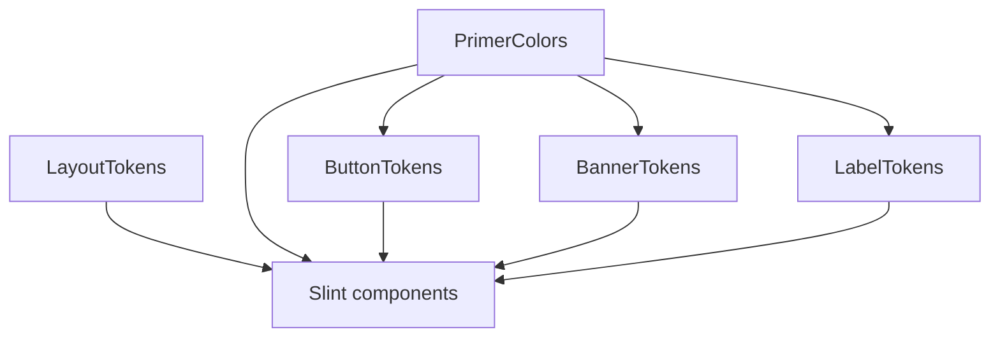

# Primer Slint — token layers and deduplication

## Canonical rules (read first)

- [`app/src/ui/Primer/AGENTS.md`](../../../app/src/ui/Primer/AGENTS.md) — **global declaration order**, token layer summary table, cross-global `out`-only rule.

Follow them in `tokens.slint`. Dependency overview:

## Goal

Every **shared** color exists as **one** primitive or semantic `out` in the right global; component-friendly names (e.g. `button-*`) **compose** from `PrimerColors` / other globals instead of repeating the same hex.

## Workflow

1. From [`primer-port-upstream-research`](../primer-port-upstream-research/SKILL.md) inventory, list **visuals** needed (light/dark, states).
2. For each visual, map to **primer-tokens** key(s) or justify a new semantic name.
3. **Search existing `out` properties** in `LayoutTokens`, `PrimerColors`, `ButtonTokens`, `CheckboxTokens`, `BannerTokens`, `LabelTokens` before adding literals.
4. **New shared color:** add **one** private literal (or small primitive group) under `PrimerColors`, expose via `out`, reference from dependents.
5. **New lengths/typography:** prefer `LayoutTokens` unless truly one-off (then private on the component per AGENTS).
6. **Scheme:** follow `color-scheme == ColorScheme.dark ? …` (or existing pattern) on `out` properties.
7. After edits, verify Slint loads (see [Verification](../../../app/src/ui/Primer/AGENTS.md#verification) in AGENTS).

## Deliverable: token audit table

Complete before merging token changes:

| Intent (UI meaning) | primer-tokens / source | Single owner global | `out` property name | Consumers (globals / components) |
|--------------------|-------------------------|---------------------|---------------------|----------------------------------|
| … | … | `PrimerColors` / … | … | `ButtonTokens`, … |

If two rows would use the **same hex for the same meaning**, merge into **one** `out` and reference it.

## Anti-patterns

- Same hex repeated in `PrimerColors` and `ButtonTokens` for the same semantic.
- New literals in `BannerTokens` / `LabelTokens` (AGENTS: compose only from `PrimerColors`).
- Breaking **declaration order** in `tokens.slint` (CheckboxTokens after ButtonTokens, etc.).

## Related skills

- Upstream names: [`primer-port-upstream-research`](../primer-port-upstream-research/SKILL.md)
- States in components: [`primer-slint-interaction-states`](../primer-slint-interaction-states/SKILL.md)
