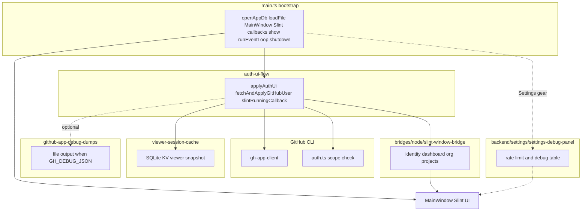
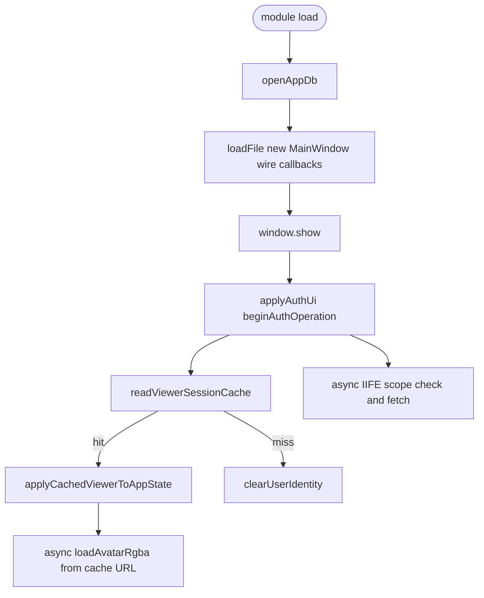
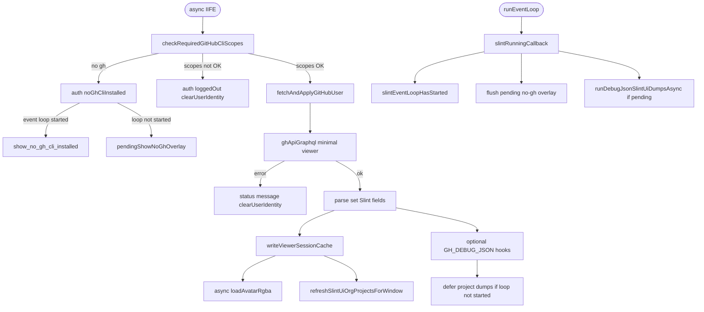

# github-app

Slint desktop UI that reads data from the [GitHub CLI](https://cli.github.com/) (`gh`) on your machine.

## Prerequisites

- **pnpm** (see [pnpm.io](https://pnpm.io/installation)). You need pnpm on your `PATH` first; it reads this repo’s [`.npmrc`](.npmrc).
- **Node.js** 24 or newer. This project sets **`use-node-version`** in [`.npmrc`](.npmrc) so **pnpm downloads and uses that Node version** when you run `pnpm install` or `pnpm run …` if you don’t already have it (see [pnpm `use-node-version`](https://pnpm.io/npmrc#use-node-version)). Run scripts via **`pnpm`** (e.g. `pnpm dev`) so that Node is used. Invoking **`node` directly** on the host may still use whatever Node is on your `PATH`, not pnpm’s copy.
- **GitHub CLI** (`gh`) **2.89.0 or newer** on your `**PATH`** (Windows, macOS, and Linux use the same command name; the app does not ship `gh`). If it is missing, the UI shows a **no CLI installed** state with no **Login** button until you install it from [cli.github.com](https://cli.github.com/). If `gh` is older than 2.89.0, the UI shows a blocking message with a link to the install page. After install, authenticate with `gh auth login` or the in-app **Login** flow. The minimum version is enforced in code ([`MIN_GH_CLI_VERSION`](app/src/backend/gh/gh-cli-version.ts)).

**OAuth scopes:** The app expects classic token scopes `**read:org`**, `**read:project**`, and `**notifications**` (see [scopes.md](scopes.md): `**repo**` alone also satisfies the notifications requirement in scope checks). If `gh` is missing them (or scopes cannot be verified), the UI stays **logged out** with an explanation—use **Login** to authorize with the required scopes. The Dashboard **Security alerts** tab (Dependabot) is optional and needs **`repo`** or **`security_events`** on the token; it is not required for signing in (see [scopes.md](scopes.md)).

## Setup

This repository is a **pnpm monorepo**: the Slint desktop app lives under [`app/`](app/) (TypeScript in `app/src/`, UI in `app/src/ui/…`), [`packages/slint-bridge-kit`](packages/slint-bridge-kit/) is the TypeScript bridge helpers package, and [`packages/primer-slint/slint`](packages/primer-slint/slint/) is the Primer design system Slint library. The app imports it with **relative paths** (for example `../../../packages/primer-slint/slint/primer.slint` from `app/src/ui/main.slint`). Install and run scripts from the **repository root** unless you `cd app` explicitly.

From the project root:

```bash
pnpm install
```

The first `pnpm install` may download the Node version from [`.npmrc`](.npmrc) (`use-node-version`) into pnpm’s cache, then install dependencies. The first install also runs native install steps for `**slint-ui**` and `**sharp**`. If your package manager blocks install scripts, allow those packages (this repo lists them under `pnpm.onlyBuiltDependencies` in the **root** [`package.json`](package.json)).

## Dependencies (runtime)

- **[slint-ui](https://www.npmjs.com/package/slint-ui)** — Slint UI for Node ([Slint-node docs](https://docs.slint.dev/latest/docs/node/)).
- **[arktype](https://www.npmjs.com/package/arktype)** — Runtime validation of JSON returned by `gh api` (REST) and `gh api graphql` (see `app/src/backend/schemas/`). The signed-in user profile comes from a **minimal GraphQL `viewer`** query, validated in `app/src/backend/schemas/gh-graphql-viewer-minimal.ts`.
- **[sharp](https://www.npmjs.com/package/sharp)** — Decodes the profile image from `avatarUrl` (PNG/JPEG/WebP, etc.) into RGBA for Slint’s `Image` element (`app/src/backend/gh/avatar-image.ts`). If download or decode fails, the window still opens and only the label may be shown.

## Run

```bash
pnpm start
```

This runs the **`github-app`** workspace script from [`app/package.json`](app/package.json): `write-build-info` then `node src/main.ts` with **cwd `app/`** (TypeScript is executed directly via Node’s built-in type stripping). You can also run `cd app && pnpm dev`.

### Primer gallery (standalone)

To open a separate window that demos Primer components (Storybook-style groups; no GitHub CLI or sign-in), run from the repository root:

```bash
pnpm dev:gallery
```

That runs [`packages/slint-gallery/node/gallery-main.ts`](packages/slint-gallery/node/gallery-main.ts). See [`packages/slint-gallery/README.md`](packages/slint-gallery/README.md) and [`packages/primer-slint/AGENTS.md`](packages/primer-slint/AGENTS.md).

**Login from a terminal:** The app starts **Login** as `gh auth login --web --git-protocol ssh --skip-ssh-key --scopes read:org,read:project,notifications` (scopes match `[REQUIRED_GH_OAUTH_SCOPES](app/src/backend/gh/required-scopes.ts)`) with inherited stdio so the browser OAuth flow runs with fewer prompts. That sets GitHub **git** protocol to **SSH** for this login; switch to HTTPS afterward with `gh config set git_protocol https -h github.com` if you prefer. Run `**pnpm start`** from a terminal session (not only from a GUI launcher that does not attach a TTY), or sign in with `gh` yourself first. Purely GUI launches without a usable stdin/stdout may need a different approach later.

If `gh` uses the **device code** flow, the overlay shows the one-time code and an **Open GitHub** button that copies the code to the clipboard and opens the device page in your browser (same output is still mirrored in the terminal).

### Typecheck

```bash
pnpm typecheck
```

### TypeScript layout


| Area                                                                         | Role                                                                             |
| ---------------------------------------------------------------------------- | -------------------------------------------------------------------------------- |
| `[app/src/main.ts](app/src/main.ts)`                                                 | Entry: open DB, `loadFile` / `MainWindow`, Slint callbacks, event loop, shutdown |
| `[app/src/bridges/slint/](app/src/bridges/slint/)` (e.g. `app-state.slint`)          | Slint **global** definitions (`AppState`, `SettingsState`, `TimeReportingState`) consumed by `ui/` |
| `[app/src/bridges/node/slint-interface.ts](app/src/bridges/node/slint-interface.ts)`                           | Types for `MainWindow`, `AppState`, `SettingsState`, `TimeReportingState` (keep in sync with `bridges/slint`) |
| `[app/src/backend/auth/auth-ui-flow.ts](app/src/backend/auth/auth-ui-flow.ts)`                       | Sign-in scope check, viewer fetch, session cache, `runEventLoop` startup hooks   |
| `[app/src/bridges/node/slint-window-bridge.ts](app/src/bridges/node/slint-window-bridge.ts)`                   | Mutates `AppState` / window fields (dashboard, projects, identity)               |
| `[app/src/backend/settings/settings-debug-panel.ts](app/src/backend/settings/settings-debug-panel.ts)`                 | Settings debug table + GraphQL rate-limit polling                                |
| `[app/src/backend/settings/settings-security-alerts-repo.ts](app/src/backend/settings/settings-security-alerts-repo.ts)` | Security alerts repo field: validate, KV, notify `slint-window-bridge` to refetch |
| `[app/src/backend/gh/gh-app-client.ts](app/src/backend/gh/gh-app-client.ts)`                         | `gh api` / `gh api graphql` JSON helpers                                         |
| `[app/src/backend/gh/viewer-queries.ts](app/src/backend/gh/viewer-queries.ts)`                       | GraphQL query strings for viewer load + debug dump                               |
| `[app/src/debug/github-app-debug-dumps.ts](app/src/debug/github-app-debug-dumps.ts)` | `GH_DEBUG_JSON=1` file output orchestration                                      |
| `[app/src/backend/time-reporting/time-reporting-ui.ts](app/src/backend/time-reporting/time-reporting-ui.ts)` | `TimeReportingState` callbacks: view enter/exit, project picker, KV + debug dump |
| `[app/src/backend/time-reporting/time-reporting-selected-project-kv.ts](app/src/backend/time-reporting/time-reporting-selected-project-kv.ts)` | SQLite KV `time_reporting/selected_project_v1` (chosen ProjectV2) |
| `[app/src/backend/time-reporting/dump-time-reporting-project-debug.ts](app/src/backend/time-reporting/dump-time-reporting-project-debug.ts)` | Unconditional `debug-json/time-reporting--project-v2--…` and `time-reporting--project-v2-items--…` writes |
| `[app/src/backend/gh/graphql-project-v2-node.ts](app/src/backend/gh/graphql-project-v2-node.ts)` | GraphQL `node(id: …) { … on ProjectV2 { … } }` via `gh` |
| `[app/src/backend/gh/graphql-project-v2-items-all.ts](app/src/backend/gh/graphql-project-v2-items-all.ts)` | Paginated `ProjectV2.items` + `fieldValues`; `Issue` / `PullRequest` `content` includes `closedAt` / `mergedAt` for time reporting |
| `[app/src/backend/schemas/gh-graphql-project-v2-node-response.ts](app/src/backend/schemas/gh-graphql-project-v2-node-response.ts)` | Parse / validate that response shape (see tests) |

### Time reporting

The **Time reporting** view (clock icon in the sidebar) lets you choose an **open** GitHub Project V2 from the **`slint-ui`** org—the same list used for search/filter elsewhere. The **project picker** dialog search box filters the full in-memory org list; **`projects_filtered_model`** holds one **page** of rows, **`projects_filtered_count`** is the total match count, and **`Pagination`** (Primer) steps through pages (`applyProjectPickerSliceToWindow` in [`slint-ui-org-projects-ui.ts`](app/src/backend/gh/slint-ui-org-projects-ui.ts)). Picker chrome and callbacks live on **`TimeReportingState`** ([`time-reporting-state.slint`](app/src/bridges/slint/time-reporting-state.slint)) and **`AppState`** ([`app-state.slint`](app/src/bridges/slint/app-state.slint)), mirrored in TypeScript as [`TimeReportingStateHandle`](app/src/bridges/node/slint-interface.ts) / [`AppStateHandle`](app/src/bridges/node/slint-interface.ts). The selected board is stored in the app SQLite database under the KV key **`time_reporting/selected_project_v1`** (schema in [`time-reporting-selected-project-kv.ts`](app/src/backend/time-reporting/time-reporting-selected-project-kv.ts)).

Each time you confirm a project, the app writes the raw GraphQL response to **`debug-json/time-reporting--project-v2--<sanitized-node-id>.json`** (or `…--error.json` on failure), then **`debug-json/time-reporting--project-v2-items--<sanitized-node-id>.json`** with every board card from paginated `ProjectV2.items`. Each item includes **`fieldValues`** (custom columns) and, for linked **`Issue`** / **`PullRequest`** content, GraphQL timestamps **`closedAt`** and (for pull requests) **`mergedAt`**. Payload metadata: `source`, `projectNodeId`, counts, and `items` as raw nodes (or `…--error.json` if that fetch fails). Those writes do **not** require `GH_DEBUG_JSON`. With **`GH_DEBUG_JSON=1`** (e.g. [`pnpm dev:debug`](app/package.json)), the same files are refreshed **after sign-in** if a project is already stored, alongside the other debug dumps—see [Debug mode](#debug-mode-json-dumps) below.

**Week grid:** After items load, the UI shows a scrollable table with **Mo–Fr** and **Total**. The header shows the selected **ISO week** as **`YYYY-Www`** (e.g. `2026-W13`) plus the UTC Monday–Friday date range. **Only rows that belong to that week** appear: each row is a titled **Issue** or **Pull request** with **`BOT-Total Time Spent(h)` &gt; 0** and a merge/close instant whose **ISO week (UTC)** matches the selection. Hours from that BOT field are converted to **integer minutes** with **`Math.round(hours * 60)`**. All of those minutes are shown in **one** weekday column—the **UTC calendar day** of **`mergedAt`** (PR, preferred) or **`closedAt`** (PR fallback, or Issue); **Saturday/Sunday UTC** map to **Friday** of the same ISO week so the grid always has a single day cell plus **Total**. **Previous week**, **Next week**, and **This week** rebuild the list from the **in-memory cache** without calling GraphQL again. **Refresh** re-fetches items and rebuilds. Weeks with no matching merges/closes or zero BOT totals show an empty grid with a short hint.

Implementation: [`buildTimeReportingWeekRows`](app/src/backend/time-reporting/build-time-reporting-week-rows.ts), [`referenceCloseOrMergeInstantIso`](app/src/backend/time-reporting/time-reporting-item-reference.ts), ISO helpers in [`iso-week.ts`](app/src/backend/time-reporting/iso-week.ts).

**Custom fields (board name must match or change the constant in code):**

- **`BOT-Total Time Spent(h)`** — Project V2 **number** field; this is the **only** hours value used for the time-reporting grid. Constant: [`BOT_TOTAL_TIME_SPENT_FIELD_NAME`](app/src/backend/time-reporting/project-v2-item-hours.ts).

**Not used by the time-reporting grid:** manual **`Time Log`** text parsing (the parser and [`TIME_LOG_FIELD_NAME`](app/src/backend/time-reporting/parse-time-log.ts) remain for tests and any external scripts) and the **`Time Spent(h)`** field ([`TIME_SPENT_FIELD_NAME`](app/src/backend/time-reporting/project-v2-item-hours.ts)).

**Cell drill-down:** Tap a **weekday** or **Total** cell to open a modal with the **Issue / Pull request** title, URL when present, and the **BOT-Total** amount plus the **merge/close** timestamp text stored for that cell.

**Contributors:** changes under `app/src/backend/time-reporting/` and related UI should leave **`pnpm autofix`** and **`pnpm test`** clean (no errors or warnings). Project node shape remains validated in tests via [`parseProjectV2NodeFromGraphqlResponse`](app/src/backend/schemas/gh-graphql-project-v2-node-response.ts).

Keep the following diagrams aligned with `[app/src/main.ts](app/src/main.ts)` and `[app/src/backend/auth/auth-ui-flow.ts](app/src/backend/auth/auth-ui-flow.ts)` when refactoring.

### Architecture

High-level module boundaries: `[main.ts](app/src/main.ts)` only orchestrates; auth, GitHub subprocess calls, UI mutations, session KV, and optional debug live in the modules named in the TypeScript layout table above.




### Startup, cache, and auth checks

**Sync bootstrap and cache hydrate** — runs before the first `gh` scope check; a cache hit still gets reconciled against the network in the async phase below.




**Async scope check, viewer fetch, and event loop** — each awaited step also bails out if `applyAuthUi` was re-entered (`authOperationEpoch` no longer current).




## Debug mode (JSON dumps)

When `**GH_DEBUG_JSON=1**`, each successful `gh api …` response is pretty-printed to the `**debug-json/**` directory (gitignored). Useful for inspecting API payloads while building the UI.

**Do not** enable this while screen-sharing; responses can include account details or other sensitive data.

**Time reporting:** When you pick a project in the **Time reporting** view, the app always writes `debug-json/time-reporting--project-v2--<sanitized-node-id>.json` with the raw GraphQL `node(id: …) { … on ProjectV2 { … } }` response (or `…--error.json` if the request fails), then `debug-json/time-reporting--project-v2-items--<sanitized-node-id>.json` with all `ProjectV2.items` pages aggregated (or `…--error.json` for the items fetch). Those writes do **not** depend on `GH_DEBUG_JSON`. With **`GH_DEBUG_JSON=1`** (e.g. `pnpm dev:debug`), the same files are **written again after sign-in** if you already have a stored time reporting project—so you see them without re-opening the picker. If you have never chosen a project, open **Time reporting** and pick one once (or run a normal `pnpm start`, pick, then use `pnpm dev:debug`).

Run with the helper script (works on Windows, macOS, and Linux via [cross-env](https://github.com/kentcdodds/cross-env)):

```bash
pnpm dev:debug
```

`pnpm dev:debug` sets `**GH_DEBUG_JSON=1**` (wide `viewer` JSON dump) and `**GH_DEBUG_SKIP_SLINT_UI_PROJECT_DUMPS=1**`, which **skips** the heaviest `**slint-ui`** work: `**assigned-open--search--…**`, `**assigned-open--project-items--…**`, and the extra REST org-membership pass used only for full debug. It still writes `**projects-v2--org--slint-ui.json**` (when non-empty) and `**assigned-open--projects-list--slint-ui.json**` from the **same single** org `projectsV2` fetch that powers Settings—no second pagination. It also writes `**notifications--threads.json`** (REST `**GET /notifications**`, `per_page=50`, `all=true`, paginated) when signed in with the required scopes; API failures still land in `**notifications--threads--error.json**`.

To run with **full** project-related dumps as before, use:

```bash
pnpm dev:debug:projects
```

(or any `GH_DEBUG_JSON=1` run **without** `GH_DEBUG_SKIP_SLINT_UI_PROJECT_DUMPS=1`).

Same as `pnpm dev:debug` without the helper script:

```bash
GH_DEBUG_JSON=1 GH_DEBUG_SKIP_SLINT_UI_PROJECT_DUMPS=1 pnpm start
```

On Windows (cmd), set both variables before `pnpm start` if you prefer.

Files are named from the API path or query purpose, for example `debug-json/gh-graphql--viewer-status.json` for the wide GraphQL `viewer` debug dump, or `gh-api--user--orgs--….json` for REST calls.

With `**pnpm dev:debug**`, you get the viewer dump plus the `**slint-ui` org project list** files above. The following **additional** project-related debug files run only when `**GH_DEBUG_SKIP_SLINT_UI_PROJECT_DUMPS` is not set** (e.g. `pnpm dev:debug:projects` or `GH_DEBUG_JSON=1` without the skip flag): org membership REST (`projects-v2--orgs-membership.json`), **assigned-open** search and per-project item dumps.

When signed in, the app also dumps **project-related** data for debug (full mode): `projects-v2--orgs-membership.json` for org membership (REST), then GraphQL `**projectsV2`** for the `**slint-ui**` org only (`projects-v2--org--slint-ui…`). That org list is fetched **once** per run and reused for `**assigned-open--projects-list--slint-ui.json`** (same `projectsV2` payload shape). The payload is a list of `ProjectV2` fields. It does **not** write user-scoped project files (`projects-v2--user--…`) in that mode. The debug helper without an org filter also dumps **your** user projects (GraphQL) and **all** of your orgs (for local experimentation). `**read:project`** is required (see [scopes.md](scopes.md)). Failures appear as `*--error.json` for that call.

**Assigned open work (`slint-ui`):** the app runs `**gh search issues`** (assignee `@me`, owner `slint-ui`, `--state open`, `--include-prs`) → `debug-json/assigned-open--search--slint-ui.json`. There is **no** GitHub API that lists “org projects that contain open work assigned to me” in one shot; project boards are queried **per project**. The project list comes from the same GraphQL `**organization.projectsV2`** shape as `projects-v2--org--slint-ui…`, including `**items.totalCount**` on each project (that count is **all** cards on the board—open and closed—not “open assigned to me”). That snapshot is written as `assigned-open--projects-list--slint-ui.json` (`source`, `projects`, …). For each **non-closed** project with `**items.totalCount > 0`**, project rows are written as `assigned-open--project-items--slint-ui--<projectNumber>.json`. Projects with **no items at all** skip item fetch and still emit `{ "items": [], "totalCount": 0 }` for that stem.

**Default path (`GH_DEBUG_ASSIGNED_PROJECT_ITEMS` unset or not `graphql`):** uses `**gh project item-list`** with `--query` `assignee:@me is:open -is:archived`, matching the Projects UI filter language. `item-list` uses **GraphQL** under the hood; running many in parallel (and alongside other debug GraphQL) often triggers `**API rate limit exceeded`**. By default only **one** `item-list` runs at a time. Set `**GH_DEBUG_ASSIGNED_ITEM_LIST_CONCURRENCY`** to a small integer (e.g. `2`–`4`) for more parallelism (capped at 8).

**Optional batched GraphQL path:** set `**GH_DEBUG_ASSIGNED_PROJECT_ITEMS=graphql`** to fetch items via `**gh api graphql**` using several `node(id: …)` aliases per HTTP request (fewer subprocesses and round-trips). Tune batch width with `**GH_DEBUG_ASSIGNED_PROJECT_ITEMS_BATCH**` (default **5**, max **10**). Payloads include `**"source": "graphql-batched"`** and a `**filter**` string describing **client-side** rules (`isArchived` on `ProjectV2Item`, `OPEN` issues/PRs, assignee match, draft issues by assignee)—close to the CLI query but **not guaranteed identical**. GraphQL **rate-limit points** are **not** guaranteed lower than `item-list`; batching is mainly **efficiency of requests**. If `**viewer { login }`** fails, the app logs to stderr and **falls back** to `gh project item-list`.

**Project tasks** can include **draft issues** that are not repo issues until converted. Subcommand / batch failures write `*--error.json` next to that stem.