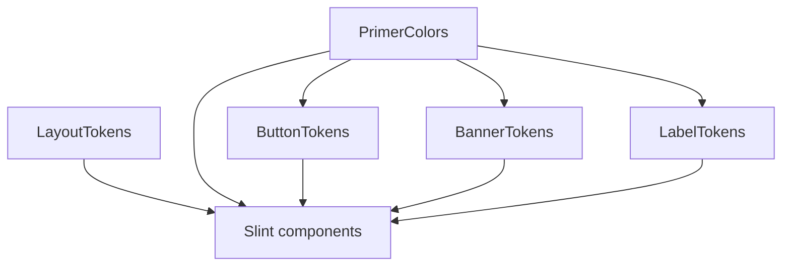

# Primer Slint — guide for contributors and AI assistants

This document stands alone in the repo. Past chats or Cursor plan files are not a reliable archive; use **local upstream clones** and the files linked below when porting or extending components.

## Purpose

- **Audience:** Humans and AI assistants adding **Primer-style** UI in Slint under `app/src/ui/Primer/`.
- **Goals:** Stay close to Primer naming and layering, avoid duplicating color literals across globals, keep `export global` declaration order valid for Slint, and ship changes in reviewable steps.

## Upstream references (consult before inventing values)

| Location                              | Role                                                                                                                                                                                                                                                                                                                                                     |
| ------------------------------------- | -------------------------------------------------------------------------------------------------------------------------------------------------------------------------------------------------------------------------------------------------------------------------------------------------------------------------------------------------------- |
| `/Users/nigelb/slint/primer-tokens`   | **primer-tokens** — functional and component token JSON5 (e.g. `src/tokens/functional/color/control.json5`, `functional/size/size.json5`, `component/button.json5`, shadow tokens). Use for **token names**, **layering** (base → functional → component), and **hex / hsla / hsv** as the source of truth when porting.                                 |
| `/Users/nigelb/slint/primer-ui-react` | **primer-ui-react** — how tokens become **CSS custom properties** in `*.module.css` (e.g. `internal/components/TextInputWrapper.module.css`, `Select/Select.module.css`, `Banner/Banner.module.css`, button-related styles). Use for **interaction states**, **sizes**, **validation**, and **variable names**, even when this Slint port is simplified. |

Also see the public docs: [Primer Design System](https://primer.style/design/system).

## In-repo architecture

- **Barrel:** [`primer.slint`](primer.slint) re-exports Primer components plus `LayoutTokens`, `PrimerColors`, `ButtonTokens`, `BannerTokens`, `LabelTokens`, **`Icons`**, and `Size`. **DataTable** / **`TableContainer`** types and related enums live in the same barrel: **`DataTableCell`**, **`DataTableCellKind`**, **`DataTableColumn`**, **`DataTableRow`**, **`DataTableCellAlign`**, **`DataTableCellPadding`**, **`DataTableSortDirection`**, **`TableContainer`**, **`LabelVariant`**, **`LabelSize`**, **`IconButtonVariant`**, **`ButtonVariant`**. When adding new model fields or exports, update [`readme.md`](readme.md) (DataTable **Imports for views**).
- **Tokens:** [`tokens.slint`](tokens.slint) holds **several `export global` singletons** in one file. **Order matters:** declare `PrimerColors` before `ButtonTokens`, **`BannerTokens`**, and **`LabelTokens`**, because **`ButtonTokens`**, **`BannerTokens`**, and **`LabelTokens`** reference `PrimerColors` `out` properties only (no literals in `BannerTokens` / `LabelTokens`).

### Token layers (current convention)

| Global           | Contents                                                                                                                                                                                                                                                                                                        |
| ---------------- | --------------------------------------------------------------------------------------------------------------------------------------------------------------------------------------------------------------------------------------------------------------------------------------------------------------- |
| **LayoutTokens** | Lengths, typography sizes, line heights, control dimensions, padding, icon sizes, border radius, **banner** padding/icon sizes, **banner** action row gap (`banner-actions-gap`) and dismiss offset when actions exist (`banner-dismiss-margin-when-actions`). **No** light/dark color scheme.                  |
| **PrimerColors** | Semantic surfaces (fg, bg, border, link, overlay, shadows, success validation, control-trigger shadows, **banner functional colors** — accent/success/attention/danger/done-upsell muted surfaces and fg, etc.) plus **shared primitives** so each **hex / rgb / hsv** appears **once** when values are shared. |
| **ButtonTokens** | GitHub-style `color-btn-*` and resolved `button-*` colors, action-list tints, icon-button tints, filled-button shadow colors. Composes from **`PrimerColors` `out` properties** where possible instead of repeating literals.                                                                                   |
| **BannerTokens** | Per-variant `banner-bgColor-*`, `banner-borderColor-*`, `banner-icon-fgColor-*` aligned with `Banner.module.css` `[data-variant]`. **Composes only from `PrimerColors`** — banner surfaces must not introduce new hex in the component file.                                                                    |
| **LabelTokens**  | Per-variant `label-fg-*`, `label-border-*` for product **Label** chips, aligned with `Label.module.css` `[data-variant]`. **Composes only from `PrimerColors`** — no literals in `LabelTokens`.                                                                                                                 |

**Cross-global rule:** Treat other globals as exposing only their **`out`** bindings to dependents. Do not rely on reading another global’s **private** fields from outside that global.

### Icons (`assets/icons.slint`)

SVGs for the app are **not** scattered as inline `@image-url("../../assets/…")` across views. Slint only bundles images that appear in the source tree; the **single registry** is **[`assets/icons.slint`](assets/icons.slint)** (`export global Icons { … }`). Actual files live under **[`assets/`](assets/)** (e.g. `16px/`, `24px/`) next to that file.

**Consumption in `.slint`:** Import the global from the barrel — `import { Icons } from "../Primer/primer.slint";` (adjust the relative path from your file). Reference **`Icons.<property>`** wherever an `image` is needed (e.g. **`Icons.dot_fill`** for DataTable cell placeholders, **`Icons.sort_desc`** / **`Icons.sort_asc`** for sort affordances). **Do not** add new `@image-url` paths in Primer components or in `app/src/ui/views` / `components` for icons that should ship with the app; add the asset to the registry first, then use **`Icons.*`**.

**Property naming:** Take the SVG **basename without `.svg`**, replace every **`-`** with **`_`** → Slint identifier (e.g. `sort-desc.svg` → **`sort_desc`**, `layout-grid.svg` → **`layout_grid`**). **Exceptions:** `git-pull-request.svg` is exposed as **`pull_request`** (not `git_pull_request`) for historical/bridge reasons; **`copy.svg`** is **`copy_icon`** because `copy` is a poor fit as a property name. For **`24px/gear.svg`** vs a 16px gear, this repo uses **`gear_24`** when the 24px asset is intended.

**TypeScript / Node:** The main window exposes **`window.Icons`** (same property names as Slint, with `-` → `_` where applicable). If TypeScript code reads **`window.Icons.<name>`** (e.g. building table rows for the bridge), extend **`SlintIconsGlobal`** in [`app/src/bridges/node/slint-interface.ts`](../../bridges/node/slint-interface.ts) whenever you add a new **`out property`** so types stay accurate.

**Adding a new icon (checklist):**

1. Add the `.svg` under **`app/src/ui/Primer/assets/16px/`** or **`24px/`** (match the size folder used elsewhere for that glyph).
2. In **[`assets/icons.slint`](assets/icons.slint)**, add **`out property <image> <name>: @image-url("16px/….svg");`** (or **`24px/…`**) using the naming rule above.
3. Replace any call site that still uses a raw **`@image-url`** for that file with **`Icons.<name>`** and ensure **`Icons`** is imported from **`primer.slint`** where needed.
4. If Node/TS reads the new image from **`window.Icons`**, add the field to **`SlintIconsGlobal`** in **`slint-interface.ts`**.
5. Run verification: Slint loads **`app/src/ui/main.slint`**, **`pnpm typecheck`**.

**Banner rule:** **`Banner`** (and any future banner-like chrome) should read **background, border, and icon tint** from **`BannerTokens`** (and lengths from **`LayoutTokens`**). Leading/dismiss **SVGs** in this port use **`Icons.*`** from **`assets/icons.slint`**, not ad hoc paths. Use **`PrimerColors`** inside **`Banner`** only for non-banner semantics (e.g. default foreground for title/description text), not for ad hoc variant colors. **Product-specific sentences** (e.g. review-request copy) belong in **views**; **`Banner`** exposes structure only (`title`, `description`, optional **`description-emphasis`** / **`subtitle`**, actions).



## Adding design tokens (checklist)

1. **Naming** — Prefer Primer / CSS-variable families: `fgColor-*`, `bgColor-*`, `borderColor-*`, `control-*`, `button-*`, `shadow-*`, etc.
2. **Reuse first** — Check existing `out` properties on `LayoutTokens`, `PrimerColors`, **`ButtonTokens`**, **`BannerTokens`**, and **`LabelTokens`** before adding literals (e.g. chrome: `bgColor-default`, `borderColor-default`, `fgColor-muted`; buttons: `ButtonTokens` chains; banner surfaces: `BannerTokens` → `PrimerColors`; label chips: `LabelTokens` → `PrimerColors`).
3. **New shared color** — Add **one** private literal (or a small primitive group) under **`PrimerColors`**, expose semantics via **`out`**, then reference from **`ButtonTokens`**, **`BannerTokens`**, **`LabelTokens`**, or components. **Do not** repeat the same hex for the same meaning in multiple globals.
4. **New length / radius / typography** — Prefer **`LayoutTokens`** unless the value is truly one-off and never reused (then a **private** on the component is acceptable).
5. **Scheme** — Where colors depend on theme, follow the existing pattern: `property <ColorScheme> color-scheme: Palette.color-scheme` and `color-scheme == ColorScheme.dark ? *-dark : *-light` (or equivalent) on `out` properties.
6. **Compile** — After token edits, verify Slint loads the app entry (see [Verification](#verification)).

## Adding a new Primer component

1. Find the closest **primer-ui-react** component and the matching **primer-tokens** functional/component files.
2. Add `app/src/ui/Primer/<Name>/` with a clear root `*.slint` (and subfolders if needed).
3. **Imports:**
   - App views / chrome: **`PrimerColors`** and **`LayoutTokens`** (from `tokens.slint` or the `primer.slint` barrel).
   - Controls that use the GitHub button palette or danger/success alignment: **`ButtonTokens`** + **`PrimerColors`** as needed (see [`Buttons/buttons.slint`](Buttons/buttons.slint) and [`Select/select.slint`](Select/select.slint)).
   - **CounterLabel** (pill): [`CounterLabel/counter-label.slint`](CounterLabel/counter-label.slint) — pass explicit colors from **`Button`**, or set **`use-primer-scheme`** with **`CounterLabelVariant`** for standalone **`PrimerColors`** (`bgColor-neutral-emphasis` / `neutral-muted`, **`counter-borderColor`**).
   - **Label** (product metadata chip): **`LabelTokens`** + **`LayoutTokens`** (see [`Label/label.slint`](Label/label.slint), [`Label/logic.slint`](Label/logic.slint)); not the same as **CounterLabel**.
   - **LabelGroup** (row of **Label** chips): **`Label`** + **`LayoutTokens`** only — [`LabelGroup/label-group.slint`](LabelGroup/label-group.slint); no separate color global.
   - **DataTable** (tabular layout + sort headers + typed body cells): [`DataTable/data-table.slint`](DataTable/data-table.slint) composes **`LayoutTokens`** + **`PrimerColors`**; embeds **`Label`** + **`LabelVariant`** / **`LabelSize`** from [`Label/types.slint`](Label/types.slint) for **`label`** cells; **`Image`** for **`iconText`**; **`IconButton`** (**`IconButtonVariant.invisible`**, **`Size.small`**) for **`action`** cells. Models live in [`DataTable/types.slint`](DataTable/types.slint) (re-exported from [`primer.slint`](primer.slint)). Views fill **`columns`** / **`rows`** using barrel types plus **`LabelVariant`** / **`LabelSize`** when **`label`** cells appear; cell **`icon`** fields use **`Icons.*`** from [`assets/icons.slint`](assets/icons.slint) for **`iconText`** / **`action`** (and **`Icons.dot_fill`** or similar placeholders for other kinds). Sort header icons use **`Icons.sort_asc`** / **`Icons.sort_desc`**. No separate DataTable color global.
   - **TableContainer** (title, subtitle, table toolbar around **DataTable**): [`DataTable/table-container.slint`](DataTable/table-container.slint) — **`Button`** + **`ButtonVariant`** + **`LayoutTokens`** + **`PrimerColors`** + **`Size`**; **`DataTable`** (or other content) via `@children`.
   - **Banner** (and similar product banners): **`BannerTokens`** + **`LayoutTokens`** + **`PrimerColors`** for default text fg (see [`Banner/banner.slint`](Banner/banner.slint)).
4. **Export** new components from [`primer.slint`](primer.slint) when they are part of the public Primer surface for this app.
5. **Docs** — User-facing notes go in [`readme.md`](readme.md) (for **DataTable**, include **Imports for views** when the barrel exports or cell model change). Process, tokens, and PR workflow stay in **this file** (`AGENTS.md`).

## Typical PR sequence for a new component

Split or merge PRs by size; small widgets can combine steps. **Stage numbers are illustrative** — large features (e.g. **DataTable**) may use a separate **Docs** PR at the end for `readme.md` + `AGENTS.md` import/architecture updates (see **DataTable** in [`readme.md`](readme.md)).

| Stage                      | Focus                                                                                                                                                     |
| -------------------------- | --------------------------------------------------------------------------------------------------------------------------------------------------------- |
| **PR1 — Spike / API**      | Component shell, properties, callbacks, minimal layout; must compile; PR description lists upstream paths you mirrored.                                   |
| **PR2 — Tokens**           | New `LayoutTokens` / `PrimerColors` / `ButtonTokens` / `BannerTokens` entries; **deduplicate** literals; cite primer-tokens keys or CSS vars in the PR.   |
| **PR3 — Visual parity**    | Hover, disabled, focus, validation, sizing, shadows, typography; optional screenshots or Storybook references from primer-ui-react.                       |
| **PR4 — Integration**      | Wire into `main.slint` or a view; TypeScript bridges if needed; avoid unrelated refactors.                                                                |
| **Final — Docs / cleanup** | Update [`readme.md`](readme.md) and this file when exports or imports change; remove dead code; adjust **Barrel** / **Imports** bullets if layers change. |

Trivial components may merge PR1+PR2; large or risky work may split PR3 further.

## Implementation plans and PR breakdown tables

Any **implementation plan** for **Primer** work (or other **multi-PR** UI changes in this repo) must include an **ordered PR breakdown table** so changes can land in reviewable steps. This applies to humans and to AI assistants drafting plans in issues, design docs, or chat.

The table should list **PRs in merge order** and include at least:

| Column         | Contents                                                                                  |
| -------------- | ----------------------------------------------------------------------------------------- |
| **PR**         | Sequence number (1, 2, …).                                                                |
| **Title**      | Short, descriptive name.                                                                  |
| **Scope**      | What ships (paths, components, behavior).                                                 |
| **Acceptance** | How to verify (e.g. `pnpm typecheck`, Slint `main.slint` load, gallery or manual checks). |

Call out **dependencies** (e.g. “PR3 must follow PR2”) and **optional merges** (e.g. “PR2+PR3 may be one PR if small”). The **last row** of a plan may be a process-only PR (e.g. updating this `AGENTS.md`) when the plan itself introduces a new rule.

**Long lists (app views, not only Primer):** When a view must not instantiate every row at once, use the shared **`Pagination`** component (`Pagination/pagination.slint`), expose **page size** and **page index** on the appropriate Slint global (see **`ProjectBoardListState`** / **`AppState`** in `bridges/slint/`), and keep a TypeScript **`apply…SliceToWindow`** helper that fills an **`ArrayModel`** slice from a cached or derived full list.

## Verification

From the **monorepo root**:

```bash
pnpm typecheck && pnpm autofix && pnpm test
```

Slint: load `app/src/ui/main.slint` the same way the app does (e.g. `slint-ui` `loadFile` in `app/src/main.ts`). Fix compile errors before merging token or component changes.

## Limitations

This Slint Primer folder is **incomplete** and not pixel-identical to GitHub’s production CSS. Prefer consistency **within this repo** and traceability to **primer-tokens** / **primer-ui-react** over perfect parity in one pass.
